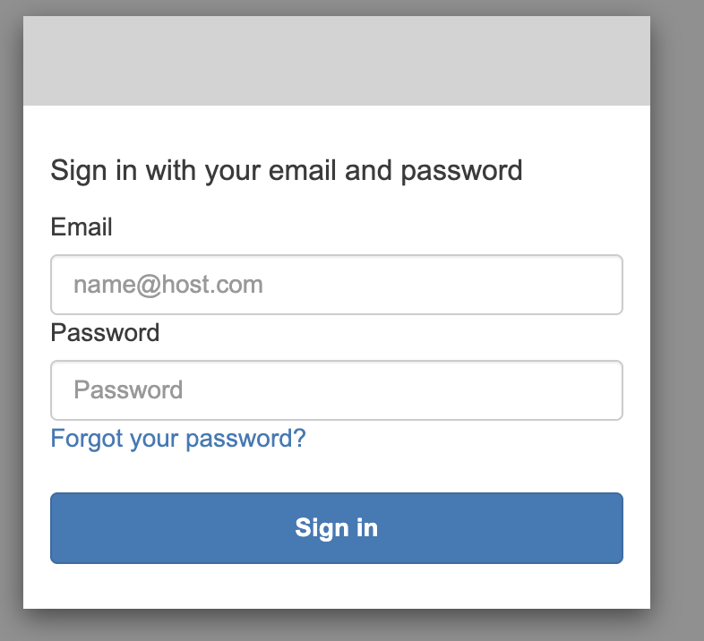
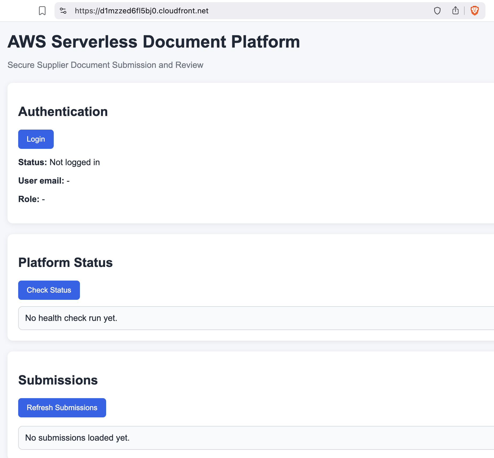
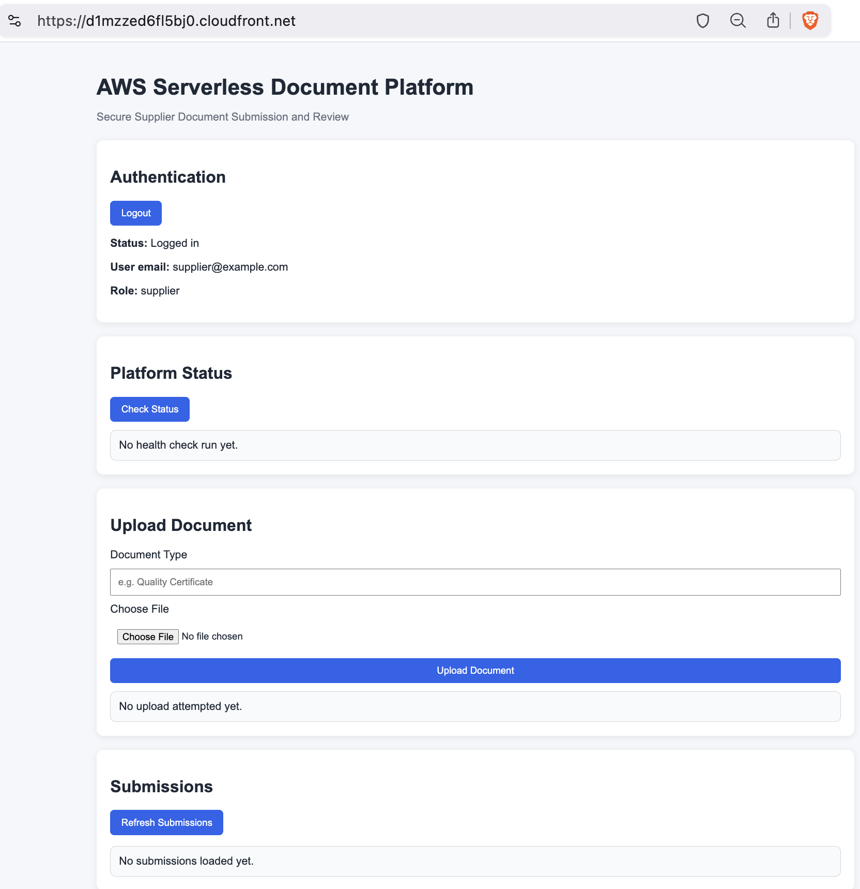
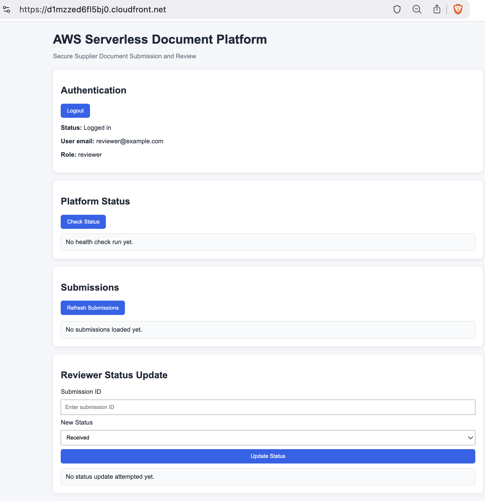
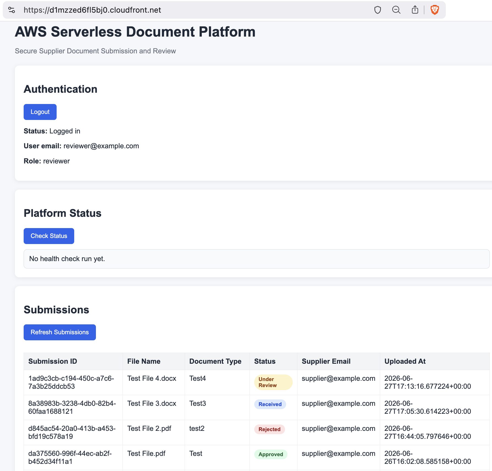
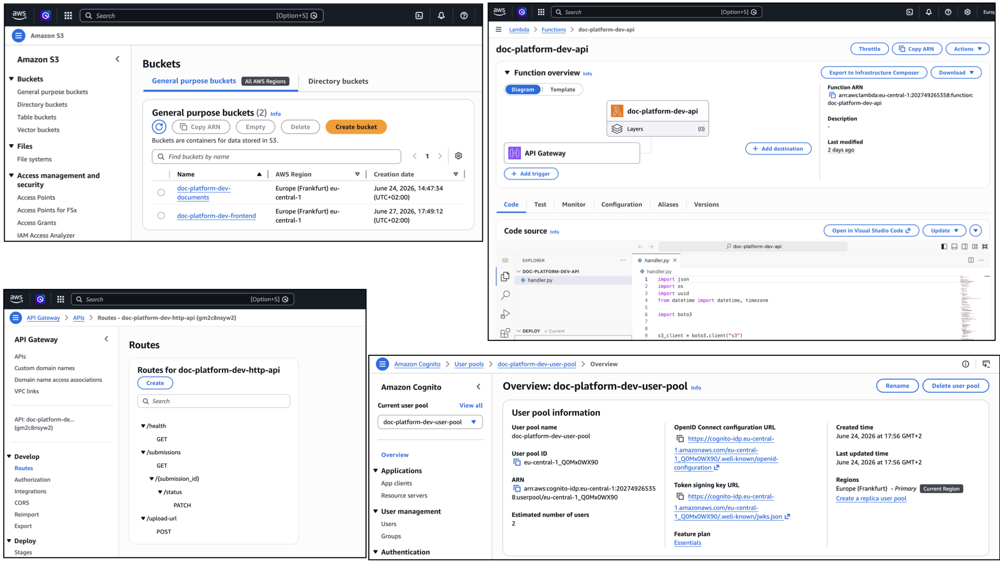

# AWS Serverless Document Platform

Hands-on implementation of a secure serverless document submission and review platform on AWS using **Terraform**, **Python**, and **vanilla HTML/CSS/JavaScript**.

This project demonstrates practical AWS and Infrastructure as Code skills by implementing a realistic business workflow for supplier document intake, review, and status tracking.

## Project Overview

A mid-sized manufacturing company needs a secure way for external suppliers to submit business-critical documents such as quality certificates, compliance declarations, and technical documents.

Instead of relying on email attachments and manual file handling, this application provides:

- secure supplier authentication
- controlled web-based document upload
- centralized document storage
- metadata and processing status tracking
- reviewer access to all submissions
- role-based access control
- deployed cloud infrastructure using Terraform

This repository contains the **working implementation** of that solution.

> The related architecture/design documentation is maintained in a separate companion repository.

---

## Implemented Features

### Supplier capabilities
- Log in using Amazon Cognito
- Upload documents through the web frontend
- Receive a pre-signed S3 upload URL from the backend
- Upload files directly to Amazon S3
- View their own submissions and statuses

### Reviewer capabilities
- Log in using Amazon Cognito
- View all submissions
- Update submission status:
  - Received
  - Under Review
  - Approved
  - Rejected

### Platform capabilities
- Store uploaded files in Amazon S3
- Store submission metadata in Amazon DynamoDB
- Protect API routes with JWT authentication
- Enforce role-based access using Cognito groups
- Send SNS notifications on new submissions
- Expose a health/status endpoint
- Serve the frontend through Amazon S3 + CloudFront
- Provision infrastructure with Terraform

---

## Architecture Summary

The implemented solution follows a serverless AWS architecture:

- **Frontend:** static HTML/CSS/JavaScript
- **Frontend hosting:** Amazon S3
- **Frontend delivery:** Amazon CloudFront
- **Authentication:** Amazon Cognito
- **API layer:** Amazon API Gateway (HTTP API)
- **Compute:** AWS Lambda (Python)
- **Document storage:** Amazon S3
- **Metadata store:** Amazon DynamoDB
- **Notifications:** Amazon SNS
- **Monitoring/logging:** Amazon CloudWatch
- **Infrastructure as Code:** Terraform

### High-level flow
1. User accesses the frontend through CloudFront
2. User logs in through Cognito Hosted UI
3. Cognito redirects back to the frontend with tokens
4. Frontend calls API Gateway with JWT token
5. Lambda validates role/identity from JWT claims
6. Supplier requests a pre-signed S3 upload URL
7. Supplier uploads file directly to S3
8. Metadata is stored in DynamoDB
9. SNS notification is published
10. Reviewer views submissions and updates status

---

## AWS Services Used

| Service | Purpose |
|---|---|
| **Amazon S3** | Document storage and frontend hosting |
| **Amazon CloudFront** | HTTPS frontend delivery |
| **Amazon Cognito** | User authentication and role grouping |
| **Amazon API Gateway** | HTTP API for frontend/backend communication |
| **AWS Lambda** | Backend logic for uploads, listing, and status updates |
| **Amazon DynamoDB** | Submission metadata storage |
| **Amazon SNS** | Notification publishing |
| **Amazon CloudWatch** | Logs and operational visibility |
| **AWS IAM** | Least-privilege permissions between services |
| **Terraform** | Infrastructure provisioning and management |

---

## Repository Structure

```text
.
├── app/
│   ├── frontend/
│   │   ├── app.js
│   │   ├── config.json
│   │   ├── index.html
│   │   └── styles.css
│   └── lambdas/
│       └── api/
│           ├── handler.py
│           └── requirements.txt
├── docs/
│   ├── functional-design.md
│   ├── mvp-scope.md
│   └── progress-tracker.md
├── infra/
│   └── terraform/
│       ├── api_gateway.tf
│       ├── cognito.tf
│       ├── lambda.tf
│       ├── main.tf
│       ├── outputs.tf
│       ├── provider.tf
│       ├── storage.tf
│       ├── terraform.tfvars.example
│       └── variables.tf
└── README.md
```

---

## Authentication and Authorization Model

The platform uses **Amazon Cognito** with two groups:

- **supplier**
- **reviewer**

### Supplier
Can:
- upload documents
- view own submissions

Cannot:
- view all submissions
- update statuses

### Reviewer
Can:
- view all submissions
- update submission statuses

Cannot:
- use supplier upload workflow

API Gateway protects business routes with a **JWT authorizer**, and Lambda reads user identity and group membership from the validated token claims.

---

## API Endpoints

| Method | Route | Purpose | Access |
|---|---|---|---|
| `GET` | `/health` | Basic platform health check | Public |
| `POST` | `/upload-url` | Generate pre-signed S3 upload URL and create submission metadata | Supplier |
| `GET` | `/submissions` | Retrieve submissions visible to the current user | Supplier / Reviewer |
| `PATCH` | `/submissions/{submission_id}/status` | Update submission status | Reviewer |

---

## Deployment Model

### Infrastructure
All AWS resources are provisioned with Terraform.

### Frontend deployment
The frontend files are uploaded to an S3 bucket and delivered through CloudFront.

### Region
This implementation is deployed in:

- **eu-central-1** (Frankfurt)

---

## Local Development Notes

During development, the frontend was also tested locally using a lightweight local server.

For local login testing, Cognito callback/logout URLs were configured for:

- `http://127.0.0.1:5500/app/frontend/index.html`

For deployed login testing, Cognito callback/logout URLs were configured for the CloudFront HTTPS domain.

---

## Screenshots

### Cognito Login
Amazon Cognito Hosted UI used for user authentication.



### CloudFront-Hosted Frontend
Frontend delivered securely through CloudFront.



### Supplier View
Supplier view with role-based upload access.



### Reviewer View
Reviewer view with access to reviewer-only status update controls.



### Reviewer View with Submission Data
Reviewer view showing populated submissions and workflow statuses.



### AWS Console Overview
Selected AWS resources used in the implementation.



---

## Key Implementation Decisions

### 1. Serverless architecture
The backend uses API Gateway, Lambda, DynamoDB, and S3 to minimize infrastructure management and align with the project’s cloud-native goal.

### 2. Pre-signed S3 uploads
Files are uploaded directly from browser to S3 instead of passing through Lambda, reducing backend load and avoiding unnecessary payload handling.

### 3. Cognito for authentication
Amazon Cognito provides managed authentication, JWT issuance, and group-based role separation without building a custom auth system.

### 4. DynamoDB for metadata
Submission records are stored separately from document files, keeping metadata queries efficient and the storage design simple.

### 5. CloudFront for deployed frontend
CloudFront provides HTTPS delivery for the frontend and enables a Cognito-compatible hosted UI callback URL.

---

## Known Limitations

This implementation is intentionally scoped as an MVP / portfolio project.

Current limitations include:

- no custom domain
- no WAF in front of CloudFront
- no full admin UI
- no S3 event-based upload confirmation workflow
- metadata is created when upload URL is requested rather than after confirmed upload completion
- no CI/CD pipeline yet
- no multi-region disaster recovery
- minimal visual UI polish beyond MVP usability

---

## Future Improvements

Potential next steps include:

- add AWS WAF in front of CloudFront
- use private S3 frontend bucket with CloudFront Origin Access Control
- add custom domain with Route 53 and ACM
- add CI/CD pipeline for Terraform and frontend deployment
- improve UI with sorting/filtering and clearer status views
- trigger metadata finalization from S3 upload events
- add structured logging and more CloudWatch alarms
- replace SNS email with SES-based formatted notifications
- add document download links for reviewers
- add audit-focused reporting and dashboards

---

## What I Learned

This project helped me practice and demonstrate hands-on skills in:

- designing and provisioning AWS serverless infrastructure with Terraform
- integrating Cognito authentication with API Gateway JWT authorization
- implementing direct browser-to-S3 uploads with pre-signed URLs
- separating document binary storage from metadata storage
- managing CORS across API Gateway, S3, CloudFront, and browser clients
- debugging Terraform, Lambda runtime issues, Cognito flows, and frontend integration
- turning a conceptual architecture into a working cloud application

---

## How to Run / Reproduce

High-level steps:

1. Configure AWS credentials locally
2. Populate `terraform.tfvars`
3. Run Terraform from `infra/terraform`
4. Create Cognito test users and assign groups
5. Build/update frontend config with Terraform outputs
6. Upload frontend files to the frontend S3 bucket
7. Access the application through the CloudFront URL

> This repository is intended as a portfolio implementation and learning project, so setup is documented at a high level rather than as a fully automated product install.

---

## Related Portfolio Context

This implementation is the hands-on build companion to a separate architecture/design repository that documents:

- business scenario
- requirements
- solution architecture
- security considerations
- cost/scalability considerations
- future improvements

Together, the two repositories demonstrate both:

- **architecture thinking**
- **practical implementation skills**

---

## Final Note

This project was built as a portfolio piece to demonstrate practical **AWS Solutions Architecture**, **serverless development**, and **Terraform-based infrastructure provisioning** skills through a realistic business use case.